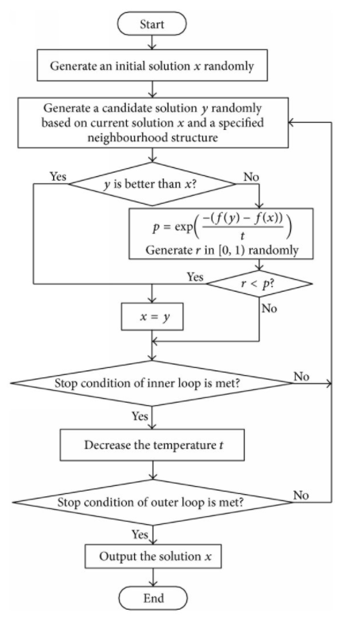

# Metaheuristic Optimization using Simmulated Annealing 

  

There are 2 discrete optimization (Travel Sales Man problems)  and 6 continous problems as below.  

&nbsp;&nbsp;&nbsp;&nbsp;&nbsp;&nbsp;&nbsp;&nbsp;[1. Find the shortest path, visiting all cities in Djibouti(38 cities)](https://github.com/Yunmi0310/Metaheuristic_DSTI/tree/master/TSP_Djibouti38)  
&nbsp;&nbsp;&nbsp;&nbsp;&nbsp;&nbsp;&nbsp;&nbsp;2. Find the shortest path, visiting all cities in Qatar(194 cities)  
&nbsp;&nbsp;&nbsp;&nbsp;&nbsp;&nbsp;&nbsp;&nbsp;3. Shifted Sphere Function   
&nbsp;&nbsp;&nbsp;&nbsp;&nbsp;&nbsp;&nbsp;&nbsp;4. Shifted Schwefel’s Problem 2.21   
&nbsp;&nbsp;&nbsp;&nbsp;&nbsp;&nbsp;&nbsp;&nbsp;5. Shifted Rosenbrock’s Function   
&nbsp;&nbsp;&nbsp;&nbsp;&nbsp;&nbsp;&nbsp;&nbsp;6. Shifted Rastrigin’s Function   
&nbsp;&nbsp;&nbsp;&nbsp;&nbsp;&nbsp;&nbsp;&nbsp;7. Shifted Griewank’s Function   
&nbsp;&nbsp;&nbsp;&nbsp;&nbsp;&nbsp;&nbsp;&nbsp;8. Shifted Ackley’s Function   

[2. install Python & create virtual environment](https://github.com/Yunmi0310/Amazon-AWS/tree/master/PYTHON)
